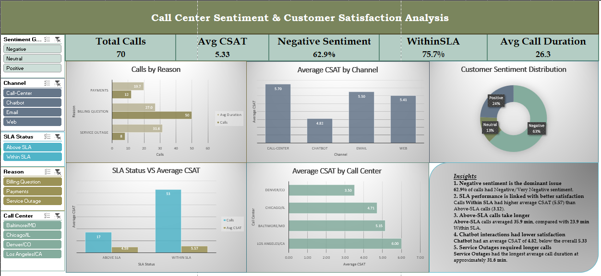

# 📊 Call Center Sentiment & Customer Satisfaction Analysis

An Excel-based data analytics project focused on analyzing **customer sentiment, satisfaction, call performance, SLA compliance, channels, call reasons, and call-center performance**.

The project transforms raw call-center data into an interactive Excel dashboard using **Power Query, PivotTables, Excel formulas, charts, and slicers** to identify patterns and generate actionable business insights.

---

## 📌 Project Overview

Customer service teams need to understand not only how many calls they receive, but also **how customers feel, how satisfied they are, how long calls take, and whether responses meet SLA requirements**.

In this project, I analyzed a sample of **70 call records** to answer questions such as:

* What is the overall level of customer satisfaction?
* How common is negative customer sentiment?
* Does SLA performance differ from customer satisfaction?
* Which channels have lower or higher CSAT?
* Which call reasons require more handling time?
* How does performance vary across call centers?
* What patterns can be identified from the available call data?

---

## 🎯 Business Objectives

The main objectives of this analysis were to:

* Measure overall customer satisfaction.
* Identify negative and positive sentiment patterns.
* Analyze SLA compliance.
* Compare CSAT across different channels.
* Identify high-volume call reasons.
* Analyze average call duration.
* Compare performance across call centers.
* Build an interactive dashboard for quick decision-making.

---

## 🗂️ Dataset

The dataset contains **70 call-center records** with information related to customer interactions.

Key fields include:

* Call ID
* Call Timestamp
* Customer Information
* Call Center
* Channel
* Call Reason
* Sentiment
* CSAT Score
* Call Duration
* Response Time
* SLA Status

> **Note:** This project uses a sample dataset of 70 records. Findings represent patterns within this dataset and should not be treated as universal conclusions about call-center operations.

---

## 🛠️ Tools & Technologies

* **Microsoft Excel**
* **Power Query**
* **PivotTables**
* **PivotCharts**
* **Excel Formulas**
* **Slicers**
* **Data Visualization**
* **Data Cleaning & Transformation**
* **Dashboard Design**

---

## 🔄 Data Preparation

The raw data was first reviewed and transformed before analysis.

### Data preparation steps

* Reviewed the raw dataset.
* Cleaned and structured the data.
* Checked data types.
* Created additional analytical columns.
* Prepared the cleaned dataset for PivotTable analysis.
* Used Power Query where appropriate for data transformation.

---

## 🧮 Calculated Columns

Several calculated columns were created to make the analysis more meaningful.

### 1. Month

Extracted the month from the call timestamp.

```excel
=TEXT([@[Call Timestamp]],"mmm")
```

### 2. Sentiment Group

Combined detailed sentiment categories into three broader groups:

* Positive
* Neutral
* Negative

This made sentiment distribution easier to analyze and visualize.

### 3. CSAT Category

Customer satisfaction scores were grouped into:

* Low
* Medium
* High

### 4. Call Duration Category

Calls were categorized based on their duration:

* Short
* Medium
* Long

### 5. SLA Status

Response performance was grouped into:

* Within SLA
* Above SLA

---

## 📊 Analysis Performed

The project uses PivotTables to analyze different aspects of call-center performance.

### Customer Sentiment

Analyzed the distribution of:

* Positive
* Neutral
* Negative
* Very Positive
* Very Negative

### Sentiment Groups

Detailed sentiment values were also consolidated into three categories:

**Positive | Neutral | Negative**

### Channel Analysis

Compared **average CSAT scores across communication channels**.

### Call Reason Analysis

Analyzed:

* Call volume by reason
* Average CSAT by reason
* Average call duration by reason

### SLA Analysis

Compared:

* Number of calls
* Average CSAT
* Average call duration

between:

* Within SLA
* Above SLA

### Call Center Analysis

Compared call volume and average CSAT across different call centers.

### Daily Call Volume

Analyzed the number of calls received across different dates.

---

## 📌 Key Performance Indicators

The completed dashboard highlights five primary KPIs:

| KPI                       |    Result |
| ------------------------- | --------: |
| **Total Calls**           |        70 |
| **Average CSAT**          | 5.33 / 10 |
| **Negative Sentiment**    |     62.9% |
| **Within SLA**            |    75.71% |
| **Average Call Duration** |  26.3 min |

---

## 📈 Interactive Dashboard

The final dashboard provides an interactive view of call-center performance.

### Dashboard Components

**KPI Cards**

* Total Calls
* Average CSAT
* Negative Sentiment
* Within SLA
* Average Call Duration

**Charts**

* Customer Sentiment Distribution
* Average CSAT by Channel
* Calls by Reason
* SLA Status vs Average CSAT
* Average CSAT by Call Center
* Average Call Duration by Reason

**Interactive Slicers**

* Sentiment Group
* Channel
* Reason
* Call Center
* SLA Status

The slicers allow users to dynamically filter the dashboard and explore different segments of the data.

---

## 💡 Key Insights

Based on the sample dataset:

### 1. Negative sentiment was dominant

**62.9%** of calls were classified as Negative or Very Negative.

This indicates that customer dissatisfaction was a major pattern within this sample.

### 2. Within-SLA calls had higher average CSAT

Calls handled **Within SLA** had an average CSAT of approximately **5.57**, compared with **3.12** for calls **Above SLA**.

### 3. Above-SLA calls took longer

Calls that were **Above SLA** averaged approximately **35.9 minutes**, compared with **23.9 minutes** for calls handled Within SLA.

### 4. Chatbot interactions had lower CSAT

The **Chatbot** channel recorded an average CSAT of approximately **4.82**, compared with the overall average CSAT of **5.33**.

### 5. Service Outages required longer handling time

**Service Outage** calls had the highest average call duration at approximately **31.6 minutes**.

> These observations describe patterns found in the 70-record sample and do not establish causation.

---

## 🖼️ Dashboard Preview



---

## 🎓 Skills Demonstrated

This project demonstrates practical skills in:

* Data Cleaning
* Data Transformation
* Excel Formulas
* Power Query
* PivotTables
* PivotCharts
* Data Aggregation
* KPI Development
* Data Visualization
* Dashboard Development
* Slicer & Filter Design
* Business Insight Generation
* Analytical Thinking

---

## 🚀 Future Improvements

Potential improvements for a larger production dataset could include:

* Automating data refresh.
* Adding more advanced statistical analysis.
* Creating trend analysis over longer periods.
* Adding agent-level performance analysis.
* Investigating relationships between sentiment, CSAT, duration, and SLA.
* Rebuilding the dashboard in **Power BI**.
* Using **Python and Pandas** for deeper data analysis.

---

## 📚 Project Purpose

This project was created as part of my **Data Analytics learning journey** to strengthen my practical skills in Excel, data analysis, visualization, and business-focused reporting.

The goal was not only to create charts, but to transform raw data into **clear, interactive, and meaningful business insights**.

---

## 👩‍💻 Author

**Aleeza Habib**

Software Engineering Student | Aspiring Data Analyst

Skills currently being developed:

**SQL • Excel • Power BI • Python • Data Analytics**

---

⭐ If you found this project useful, feel free to explore the repository and dashboard.
